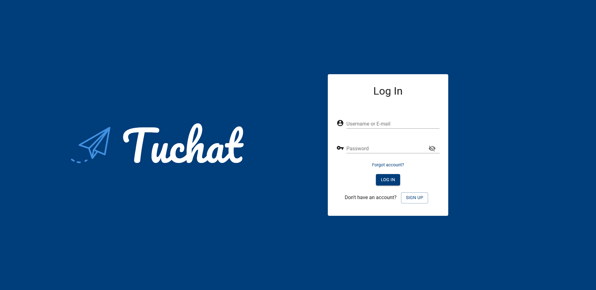
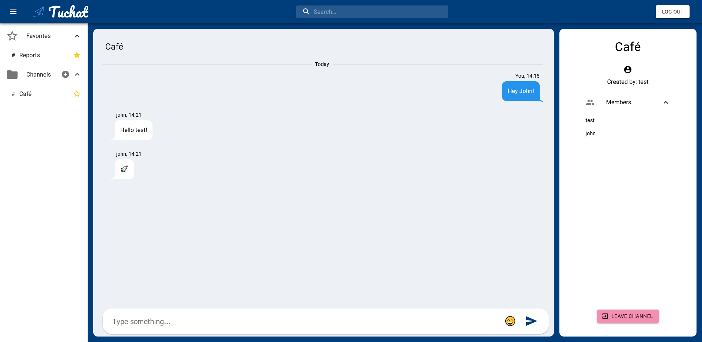

    

<h1 align="center"> Tuchat</h1>
<h4 align="center">
  A real-time chat application with channel functionality.
</h4>
 

# Technologies

Frontend

- React
- Context API
- Material.UI
- CSS

Backend

- MongoDB
- Mongoose
- Node.js
- Express
- Socket&#46;io

# Features

- User authentication.
- Password reset system via SendGrid.
- Adding, joining, leaving channels. Favorites list.
- Real time chatting with channel members.

# Screenshots

 
    
    
    

